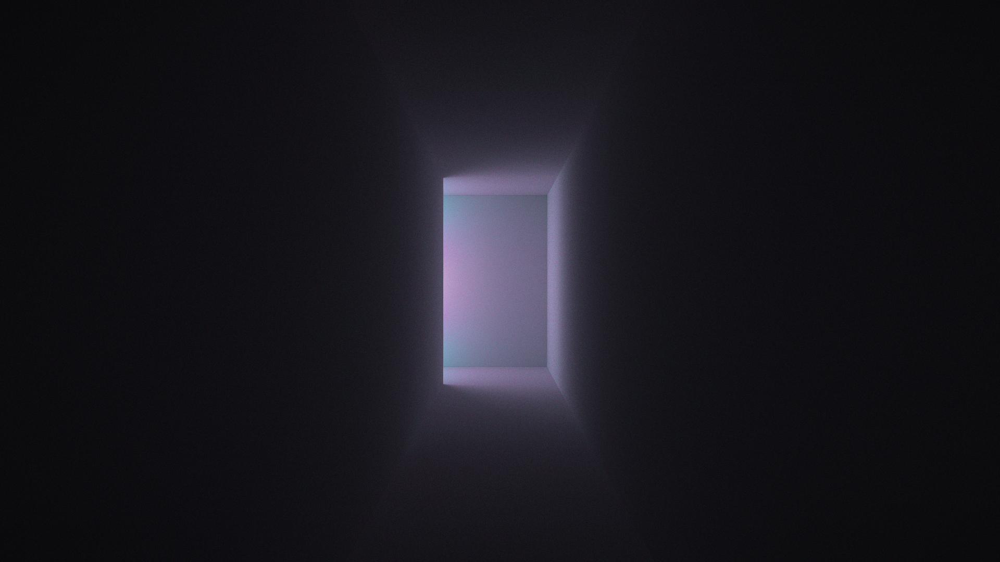

# "Light at the End of the Tunnel" by yx

This is a procedural artwork released at NOVA 2019, placing 2nd in the 4KB Executable Graphics competition.

This source code release is for archival reasons - as such, aside from removal of compiled and intermediate binaries, this is an unedited snapshot of the source from when the released artwork was built.

This uses [Shader_Minifier](https://github.com/laurentlb/Shader_Minifier) for shader minification and [Crinkler](https://github.com/runestubbe/Crinkler) for executable compression. Binaries are included in the archive as the exact versions that were used for the release.

Download & comments: https://www.pouet.net/prod.php?which=81605
